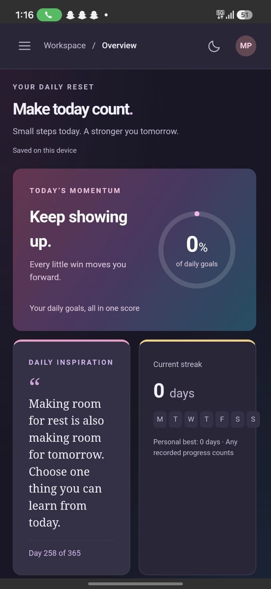
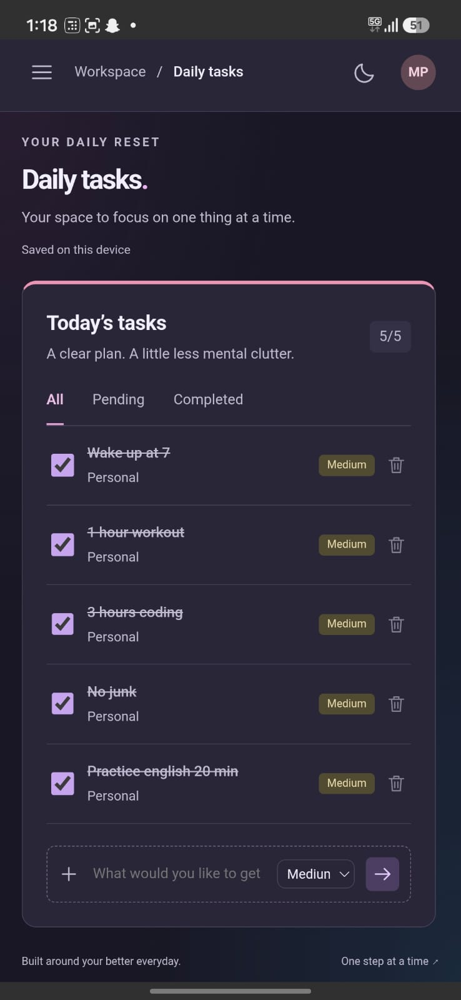
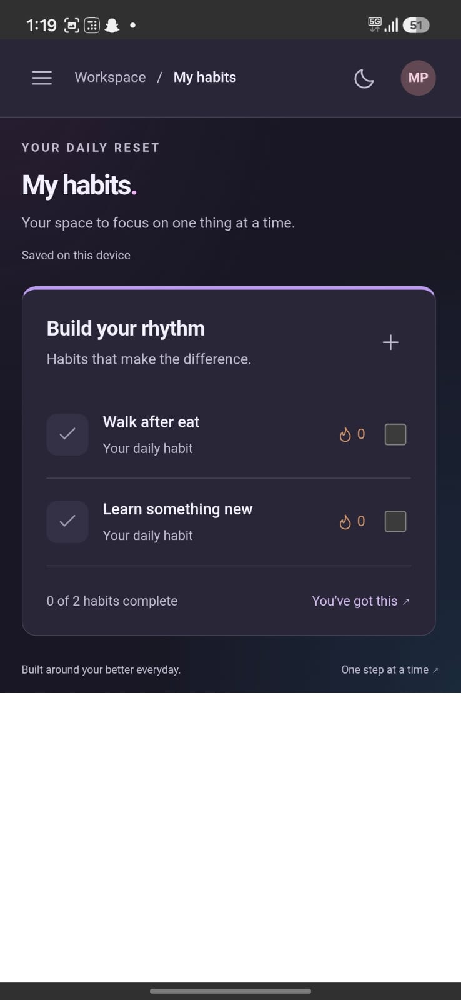
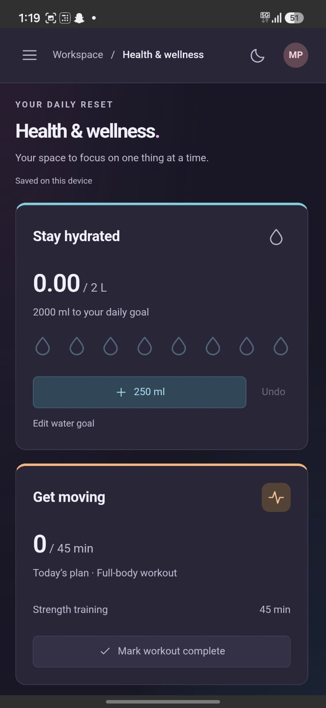
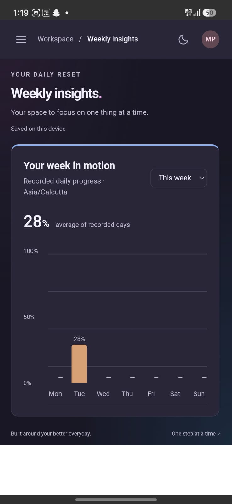

# Momentum 🚀

Momentum is a modern productivity and wellness tracking application designed to help users build better routines, stay consistent, and track their personal growth from one dashboard.

## ✨ Features

- 📋 Daily task management
- 🔥 Habit and streak tracking
- 💧 Water intake tracking
- ❤️ Health & wellness monitoring
- 💪 Body recomposition tracking
- ⏱️ Focus timer
- 📊 Weekly progress insights
- 💬 Daily motivational messages
- 👤 User profile and account section
- 📱 Responsive interface
- 📲 Android support using Capacitor

## 🛠️ Tech Stack

**Frontend**
- React
- JavaScript
- HTML5
- CSS3

**Development**
- Vite
- Node.js / npm
- Git & GitHub

**Mobile**
- Capacitor
- Android

## 🎯 Purpose

Momentum was created to combine productivity and personal wellness in one application. Instead of using separate apps for tasks, habits, hydration, focus, and fitness progress, Momentum provides a unified dashboard for managing everyday improvement.

## 🚀 Getting Started

Clone the repository:

git clone https://github.com/eshwar36/Momentum.git

Open the project:

cd Momentum

Install dependencies:

npm install

Start the development server:

npm run dev

## 📸 Screenshots

## 📸 Screenshots

### Dashboard

### Daily Tasks

### Habits

### Health & Wellness

### Weekly Insights

### Focus Timer

## 🔮 Future Improvements

- User authentication
- Cloud database synchronization
- Advanced progress analytics
- Notifications and reminders
- Cross-device synchronization
- Improved mobile experience

## 👨‍💻 Developer

Developed by **Eshwar**

B.Tech Information Technology Student

## ⭐ Support

If you find Momentum useful, consider giving the repository a star.